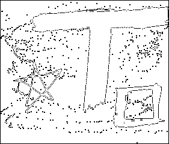
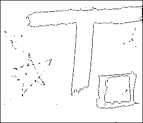

# Black&White Image Pre-Processing

## How to use
The build_in_docker.sh file takes care of building the container that has all the libraries already set up. The file [README.md](../../README.md) explains how to do that. It also explains how to flash the application on the Raspberry Pico.
Please note that I had to build the container everytime I was booting the Pico board, so try to do that if the flashing file is not able to find the Raspberry Pico.

## How the code works
- Core0 awakes the LCD screen and manages it;
- Core1 aways for Core0 to set a communication flag to 1, signaling data can be copied, pre-processed and saved to the SD-card in a .txt file as a series of 0/1 numbers;
- Through a SD-card reader the file is passed to a PC with data visualization purposes;
- The python script [here](./plot_drawing.py) takes in input the path to the .txt file and plots it. Note that the argument it takes is the version of the .txt file you want to process: 000 or 001 or ... .

